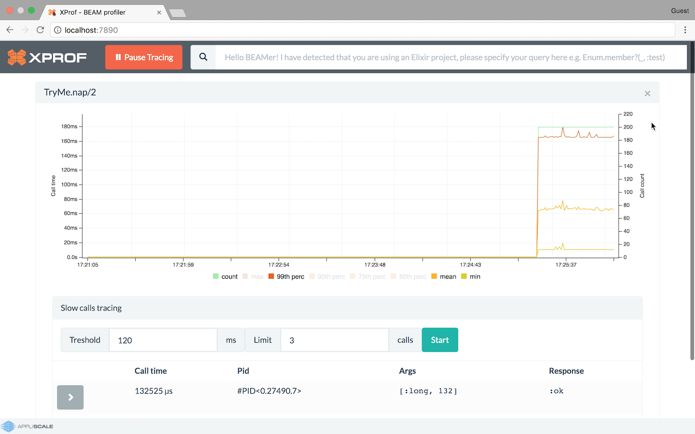

XProf [](https://travis-ci.org/Appliscale/xprof) [](https://coveralls.io/github/Appliscale/xprof?branch=master) [](https://hex.pm/packages/xprof) [](https://hex.pm/packages/xprof) [](https://gitter.im/Appliscale/xprof?utm_source=badge&utm_medium=badge&utm_campaign=pr-badge)
=====

*XProf* is a visual tracer and profiler that allows you to track execution of Elixir / Erlang
functions in real-time.

## Goal

*XProf* was originally created to help solving performance problems of live, highly
concurrent and utilized back-end systems. It's often the case that high latency or big
CPU usage is caused by very specific requests that are triggering
inefficient code. Finding this code is usually pretty difficult.

In this original usage one would first inspect execution time
statistics to get an overview of the system. Then capture arguments
and results (return value or exception) of function calls that lasted
longer than given number of milliseconds.

With the introduction of xprof-commands via an extended query syntax in
2.0 more versatile stats, filters and other features became available.

## How does it look like

Click the image below to watch a short demo investigating the `TryMe`
application with XProf. The function `nap` sometimes takes way too much time (as
you would guess from the name, it takes a bit of sleep). In the video we:
- observe call count and duration percentiles
- capture arguments and return values of a few long calls
- apply a match spec to filter out "long" calls
- compare two functions

[](https://youtu.be/CRPC6zloDS0 "XProf Demo")

## Versions

The latest stable version of XProf is 1.3.0. The upcoming 2.0.0 version is in continuous development on the `release_2.0` branch, everyone is encouraged to test the latest release condidate from hex.pm.

XProf currently supports Erlang/OTP R16B - 20 (both 1.x and 2.x versions). Newer OTP versions might work but are not tested.

## How to use it

1. Add `xprof` to your build tool config file (and optionally also to the
   release config file such as `reltool.config` in order to include it in your
   release).
2. Build your project.
3. Start `xprof` by executing `xprof:start().` in Erlang shell,
   or `:xprof.start` in Elixir shell.
4. Go to http://localhost:7890 (replace localhost with your server’s hostname if you connect to a remote host).
5. Type in function that you would like to start tracing.
6. Start tracing clicking green button.

The preferred way is to add the `xprof` *Hex* package as a dependency to your rebar3 config or Mix project file:

```erlang
%% rebar.config (at least version `3.3.3` is required):

{deps, [
       ...
       {xprof, "2.0.0-rc.4"}
]}.
```

```elixir
# `mix.exs`:

defp deps do
    [
      ...
      {:xprof, "~> 2.0.0-rc.4"}
    ]
  end
```

You can also fetch from the github repository (not recommended, only for development, requires rebar 3.14):

```erlang
{deps, [
        ...
        {xprof_core, {git_subdir, "https://github.com/gomoripeti/xprof.git", {tag, "2.0.0-rc.4"}, "apps/xprof_core"}},
        {xprof_gui, {git_subdir, "https://github.com/gomoripeti/xprof.git", {tag, "2.0.0-rc.4"}, "apps/xprof_gui"}},
        {xprof, {git_subdir, "https://github.com/gomoripeti/xprof.git", {tag, "2.0.0-rc.4"}, "apps/xprof"}}
]}.
```

## Supported Versions

XProf currently supports Erlang/OTP R16B - 23. Newer OTP versions (if
any) might work but are not tested.

## Syntax mode

XProf supports both Erlang and Elixir syntax. If the `elixir` application is
running it will use Elixir syntax and Erlang syntax otherwise to read the
function to trace and to print captured arguments. It is also possible to
manually set the preferred mode.

## XProf flavoured match-spec funs

In the function browser apart from simple module-function-arity you
can also specify further filters in the form of a match-spec functions
(similar to recon or redbug) as well as xprof commands with
options. For details see the page on [Query syntax](doc/src/querysyntax.md)

## Recursive functions

By default XProf only measures the outermost call to a recursive function. For
example `lists:map(fun f/1, [1, 2, 3]).` will only register one call to
`lists:map/2`. This is also true for indirectly recursive functions (such as
when `a` calls `b` and `b` calls `a` again). This behaviour can be undesireable
so it can be disabled by setting the `ignore_recursion` environment variable to
false.

## Erlang records

Erlang record syntax is supported in the queries and works similar to the Erlang
shell. XProf keeps a single global list of loaded record definitions. Record
definitions can be loaded at startup time from modules listed in app env
`load_records` or at runtime calling `xprof_core:rr(Module)` (see documentation
of `xprof_core` for more details). The record definitions are extracted from
debug_info of the beam files belonging to the loaded modules. As the list is
global there can be only one record with the same name loaded at a time and
records loaded later might override previously loaded ones.

## Configuration

You can configure XProf by changing the below application variables:

| Application  | Key                    | Default        | Description |
|--------------|------------------------|----------------|-------------|
| `xprof_gui`  | `ip`                   | any            | Listen address of the web interface (in tuple format, see [`inet:ip_address()`](http://erlang.org/doc/man/inet.html#type-ip_address)) |
| `xprof_gui`  | `port`                 | 7890           | Port for the web interface |
| `xprof_gui`  | `favourites_enabled`   | true           | Whether saving/loading favourite queries is enabled |
| `xprof_gui`  | `favourites_config`    | ./favourites.cfg | Path of the file storing favourite queries |
| `xprof_core` | `max_tracer_queue_len` | 1000           | Overflow protection. If main tracer proccess will have more than 1000 messages in its process queue tracing will be stopped and one needs to use trace button to resume. The purpose of this is to prevent out of memory crashes when tracer process is not able to process incomming traces fast enough. This may happen when we trace very "hot" function. |
| `xprof_core` | `max_duration`         | 30000          | The largest duration value in ms. In case a call takes even longer, this maximum value is stored instead. |
| `xprof_core` | `ignore_recursion`     | true           | Whether to only measure the outermost call to a recursive function or not (ie. measure all calls). |
| `xprof_core` | `mode`                 | <autodetected> | Syntax mode (`erlang` or `elixir`) |
| `xprof_core` | `load_records`         | []             | List of modules from which to load record definitions at startup. |

## Compile-time configuration

`XPROF_ERL_HIST` - By default XProf uses the `hdr_histogram_erl` NIF
library. If you have compilation problems you can choose to use a
native Erlang histogram implementation by defining the OS env var
`XPROF_ERL_HIST` when compiling `xprof_core`.

`COWBOY_VERSION` - By default XProf uses Cowboy version 2.x. This
version is only supported from Erlang/OTP 19 and is not backwards
compatible with older Cowboy versions. If for some reason you would
like to use Cowboy version 1.x you can define the OS env var
`COWBOY_VERSION=1` when compiling `xprof_gui`.

`XPROF_JSON_LIB` - By default XProf uses the `jsone` library. If you
would like to use a different json library you can define the OS env
var `XPROF_JSON_LIB` when compiling `xprof_gui`. It is assumed that
the library module exports an `encode/1` function that returns the
encoded binary. If your preferred json library uses a different name
for such a function, you can set it with `XPROF_JSON_ENC_FUN`.

Examples

```
export XPROF_ERL_HIST=true
export COWBOY_VERSION=1
export XPROF_JSON_LIB='Elixir.Jason'
export XPROF_JSON_ENC_FUN='encode!'
```

## Web Interface

XProf's web interface supports a lot of small but convenient features
as query autocomplition, recent queries, favourite queries, list of
called functions, collapsing graphs, multiple graphs in a row and so
on.

### Keyboard shortcuts

- **Ctrl-i**: switch between "search" and "favourites" mode of the query box

In "search" mode
- **UP**/**DOWN** arrows (cursor in query box): scroll through recent queries
- **UP**/**DOWN** arrows (cursor in suggestion list below query box): scroll
  through auto-completion suggestions
- **TAB**: if no suggetion is selected yet auto-complete to longest common
  prefix of dropdown list items. Otherwise copy the selected item to the search
  box and refresh the dropdown list.
- **ENTER**: start monitoring either the selected suggestion if there is any or the
  expression in the search box.

In "favorites" mode
- Search only starts after typing the second character. (For 0 and 1
  chars you see the list of all favorite queries)
- **UP**/**DOWN** arrows: scroll through the list
- **ENTER**: start monitoring highlighted query if there is any (also
  added to recent queries)
- **ESC**: reset search (clear the query box and hide the list)
- **TAB**: show full list of favourite queries, when the query box is
  empty and the list isn't visible

## Contributing

All improvements, fixes and ideas are very welcomed!

Project uses rebar3 for building and testing Erlang code. WebUI part resides in
`xprof_gui` app's priv directory and it's already precompiled so there is no need to
build JS sources in order to run `xprof`.

### Running tests

```bash
make test
```

### Working with JS sources

The WebUI uses

* *React.js*
* *ECMAScript 6* (with elements from *7th* version).
* *Bootstrap*
* *Webpack*

All resources are in `apps/xprof_gui/priv` directory. The `src` folder contains the sources and
the `build` folder is a placeholder for final JS generated by webpack and then
served by cowboy server (*XProf's* dependency).

### Starting XProf in development mode

To develop `xprof` in a convenient way the following setup is recommended.

You have to invoke following command once, if you do not have js dependencies or
you need to update them:

```bash
$ make bootstrap_front_end
```

Then going with normal development flow - in the first terminal window
start Erlang `xprof`. The _sync_ app will be started, It automatically
reloads erlang modules that have changed, so you don't need to
recompile every time something changed.

```bash
$ make dev_back_end
```

In the second window install all the assets and start *webpack* in
development mode which is also going to recompile all *JS* files into
`apps/xprof_gui/priv/build-dev` directory when they are modified. To
achieve that use following command:

```bash
$ make dev_front_end
```
