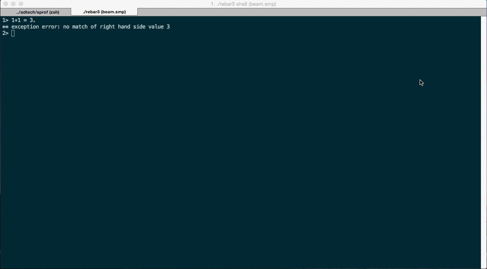

XProf [](https://travis-ci.org/Appliscale/xprof) [](https://coveralls.io/github/Appliscale/xprof?branch=master)
=====

*XProf* is a profiler that allows you to track execution time of Erlang
functions. It's also able to capture arguments and results of a function calls
that lasted longer than given number of milliseconds.

## Goal

*XProf* was created to help solving performance problems of live, highly
concurrent and utilized BE systems. It's often the case that high latency or big
CPU usage is caused by very specific requests that are triggering
inefficient code. Finding this code is usually pretty difficult.

## How to use it



1. Add `xprof` to your rebar.config (and optionally to `reltool.config` in order to include it into your release).
2. Build your project.
3. Start `xprof` by executing `xprof:start()` in Erlang shell.
4. Go to http://SERVER:7890.
5. Type in function that you would like to start tracing.
6. Start tracing clicking green button.

```erlang
{deps, [
       ...
       {xprof, ".*", {git, "https://github.com/appliscale/xprof.git"}}
]}.
```

`xprof` is available on *Hex* package manager, so you are able to use it also in the following way:

```erlang
# With `rebar3`:

{deps, [
       ...
       {xprof, "1.1.0"}
]}.
```

```elixir
# Inside `mix.exs`:

defp deps do
    [
      ...
      {:xprof, "~> 1.1.0"}
    ]
  end
```

## Configuration

You can configure `xprof` by changing its application variables:

Key         | Default     | Description
:-----------|:------------|:-----------
port        |7890         |Port for the web interface

## `xprof` flavoured match-spec funs

**CAUTION: Experimental support (WIP).**

In the function browser you can also specify further filters in the form of a
match-spec fun (similar to recon or redbug). After the module and function name
one can also give a function definition instead of arity. This gives the user
the full power of match specifications and can be used both to selectively
measure duration of function calls that match complicated filters and to capture
only part of the arguments. The function has the same limitations as
`dbg:fun2ms/1`. (See
[Match Specifications in Erlang](http://erlang.org/doc/apps/erts/match_spec.html) and
[ms\_transform](http://erlang.org/doc/man/ms_transform.html)). The function can
be terminated by a single dot or `end.` and `return_trace` is always implicitly
on (that is how `xprof` measures duration)

For example only measure the duration of `ets:lookup` on table `data`

```erlang
ets:lookup([data, _]) -> true.
```

Or only capture the `important` field of a possibly big `data` record

```erlang
ets:insert([_, #data{important = I}]) -> message(I).
```

## Contributing

All improvements, fixes and ideas are very welcomed!

Project uses rebar3 for building and testing erlang code. WebUI part resides in
`xprof` app's priv directory and it's already precompiled so there is no need to
build JS sources in order to run `xprof`.

### Running tests

```bash
make test
```

### Working with JS sources

The WebUI uses

* React.js
* ECMAScript 6
* Bootstap
* Bower
* Webpack

All sources are in _priv_ directory. The _app_ folder contains the sources and
the _build_ folder is a placeholder for final JS generated by webpack and then
served by cowboy server (xprof's dependency).

### Starting `xprof` in development mode

To develop `xprof` in convenience following setup is recommended.

In the first terminal window start Erlang `xprof` and _sync_ which automatically
reloads modules that have changed.

```bash
$ export REBAR_PROFILE=dev
$ ./rebar3 shell
> sync:go().
> xprof:start().
```

In the second window install all the assets and start webpack in development
mode which is also going to recompile all JS files in priv directory when they
are modified.

```bash
$ cd priv;
$ npm install
$ bower install
$ webpack -d
```
